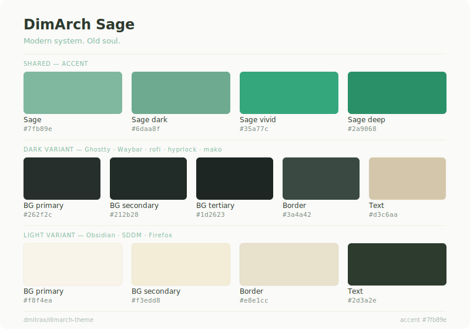

# dimarch-theme

> Sage — visual identity for DimArch OS

**Modern system. Old soul.**

Theme components for DimArch OS — Arch Linux + Hyprland.
Inspired by GNOME 2 and MATE. Built on Wayland in 2026.

---

## Palette

---

## Components

| Component | Status |
|---|---|
| Waybar CSS | 🚧 in progress |
| Ghostty | 🚧 in progress |
| rofi | 🚧 in progress |
| hyprlock | 🚧 in progress |
| mako | 🚧 in progress |
| GTK theme | 📋 planned |
| SDDM | 📋 planned |
| Telegram | 📋 planned |
| Firefox | 📋 planned |

---

## Color tokens

| File | Description |
|---|---|
| [`colors/palette.json`](colors/palette.json) | Source of truth — all color values |
| [`colors/sage-dark.css`](colors/sage-dark.css) | CSS variables — dark variant |
| [`colors/sage-light.css`](colors/sage-light.css) | CSS variables — light variant |

---

## Related repositories

| Repo | Description |
|---|---|
| [dmitrax/dimarch](https://github.com/dmitrax/dimarch) | Main installer, phase scripts, dotfiles |
| [dmitrax/dimarch-taskbar](https://github.com/dmitrax/dimarch-taskbar) | Custom bottom panel — Python + GTK4 |

---

*DimArch OS — Personal Arch Linux setup by dmitrax*
