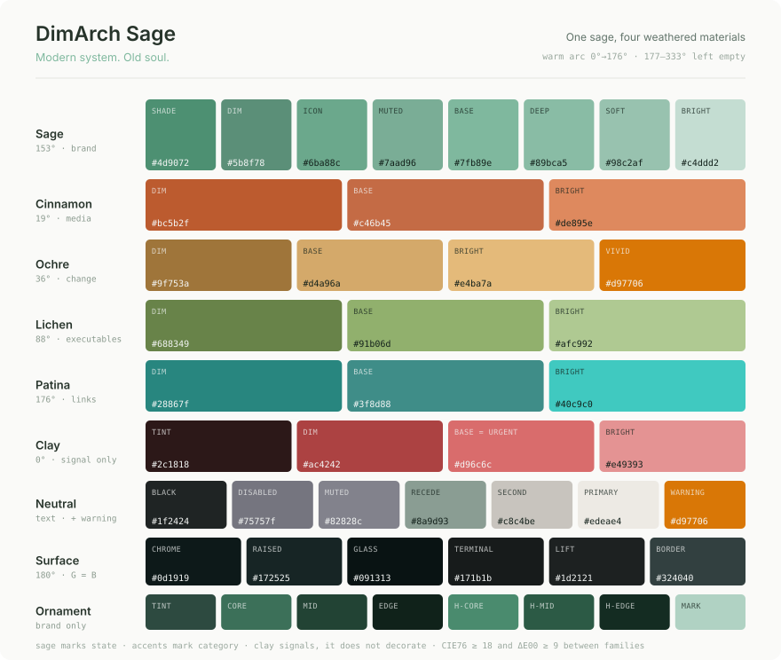

# dimarch-theme

> Sage — the colour system behind DimArch OS

**Modern system. Old soul.**

Visual identity for DimArch OS — Arch Linux + Hyprland.
Inspired by GNOME 2 and MATE. Built on Wayland in 2026.

---

## What this repository is

**A source of truth and the tools to work with it — not something you install.**

Colours are *defined* here and *shipped* by
[dmitrax/dimarch](https://github.com/dmitrax/dimarch), whose configs carry literal
values. A fresh machine clones that repository, runs its installer, and ends up
correctly themed without this one being present at all.

You need this repository when you **change** the theme: adjust a colour, add a
component, check that nothing has drifted. Not at install time.

```
dimarch-theme          decides what the colours are        ← design time
    │
    │  values are written into configs
    ▼
dimarch                ships them to the machine           ← install time
```

It is also the entry point for anything that is not a dotfile — other projects read
the CSS token files directly rather than reinventing the palette.

| | |
|---|---|
| [`colors/palette.json`](colors/palette.json) | what colours exist and what they mean |
| [`colors/components.json`](colors/components.json) | which key of which config takes which role |
| [`colors/sage-dark.css`](colors/sage-dark.css) · [`sage-light.css`](colors/sage-light.css) | the same tokens as CSS, for consumers that can read them |
| [`tools/palette`](tools/palette) | resolve, inspect and verify — see below |
| [`ROADMAP.md`](ROADMAP.md) | component migration checklist |

---

## Palette

**One sage, five weathered materials.**



Sage is not one of six equal colours — it is the anchor. It carries every tier of text,
every interface state, and roughly 18% of what is on screen at any moment, against ~4%
for all five accents combined. It is also the loudest step in the palette, so the eye
reaches it first.

The accents are named after what they are made of, because a colour named by its hue has
nothing to defend it during a later cleanup:

| Family | Hue | Carries |
|---|---|---|
| **Sage** | 153° | brand, all text, every interface state |
| **Cinnamon** | 19° | images, video, media |
| **Ochre** | 36° | change, archives, duration, attention without alarm |
| **Lichen** | 88° | executables, Node, caffeine |
| **Patina** | 176° | links, documents, symlinks, cool weather |
| **Clay** | 0° | errors, deletions, broken links, critical load — *outside the arc* |

Clay is listed last because it does not belong to the harmony. Red for failure is a
cross-platform convention, and a signal that blends in stops reading as a signal, so it
is allowed to stick out. That stays honest only while clay is never decorative: all
fifteen of its uses are semantic.

### The rule that holds it together

> **Sage marks state. Accents mark category.**

Sage means *what is happening* — active, selected, focused, successful. Accents mean
*what a thing is* — a file type, a language, a git status, a kind of signal. An accent
may never mark a state, and sage may never mark a category.

Without that rule the brand quietly decays. Measured across 53 roles, sage had drifted
down to 17% before it was written, and the theme stopped reading as Sage at all. With
it, sage holds 36% — and every one of those roles is something you interact with.

A practical consequence: **at rest the panel is entirely sage.** Colour appears only when
a module has something to report.

### Geometry

The palette occupies a warm arc from 0° to 176°. The range **177–333° is deliberately
empty** — no azure, no violet, no synthetic purple. Cold hues were tried and rejected on
a live test: next to a warm, low-saturation sage they read as foreign rather than
complementary. The brand's complement at 333° ± 10° is closed too: it breaks the
analogous scheme. A magenta family sat there until v3 and was removed for it.

There is no minimum spacing in degrees, because degrees measure the wrong thing.

### Distinguishability

Two colours that mark **different entities** and can appear side by side must differ by
**CIE76 ≥ 18 and CIEDE2000 ≥ 9** — both, since each metric alone lets its own class of
collision through. The thresholds are calibrated on pairs with a known verdict: the
worst pair judged "these blend" sits at 8.2 / 5.1, the best judged "clearly different"
at 23.8 / 13.1.

Hue degrees fail this job in both directions. Sage and patina were 23° apart — above the
old 20° minimum — and still indistinguishable; cinnamon and ochre are 17° apart and
plainly different. Running the rule found thirteen collisions the degree minimum had
passed, seven of them from one cause: patina had been given sage's exact saturation and
lightness, so a symlink looked like a directory.

The rule does **not** reach inside a family. Tiers of one family mark kindred categories
on purpose — image and video are both media — and the icon carries the finer distinction.

Every accent works through **depth** rather than brightness. At sage's own lightness an
accent competes with it and reads dusty; darker and slightly more saturated, it grounds
the composition instead.

### Contrast

Measured against both grounds — `#0d1919` (chrome) and `#171b1b` (terminal).

- `base` and `bright` tiers clear **4.5:1**, the WCAG AA threshold for text
- `dim` tiers are for fills, borders and markers — **not for small text**
- `sage.dim` is the one exception at 4.89:1, doubling as the faded text tier

The light palette is not an inversion: every accent is recalculated for a cream ground
and verified against the darker of the two light surfaces.

---

## How it is organised

Two layers. `ramp` holds the hue families; `role` maps meaning onto them.
**Components reference roles, never ramp entries.** That indirection is the point: to
merge `link` into the brand green you would first have to answer whether links should
be indistinguishable from body text. A token named by its hue has no such defence —
before this rule existed, every non-green accent had quietly been washed into sage.

A third file closes the loop. `components.json` records which key of which config takes
which role, so the question that comes first when opening a config — *what do I take,
and where does it go?* — is a lookup rather than a guess. A component counts as
migrated only once it is listed there, and the map also carries what was learned about
the component itself: which keys it actually accepts, which are inert.

## Using it

```bash
ln -s "$PWD/tools/palette" ~/.local/bin/palette
```

```bash
palette check ~/Projects/dimarch   # do the configs still match the palette?
palette component waybar           # what does this component take, and why
palette where ramp.clay.base       # what breaks if this role changes
palette role file.archive          # resolve one value
palette ramp sage                  # a hue family with contrast figures
```

`check` verifies 199 keys across six colour notations and exits non-zero on a
mismatch, so it works from a hook or CI. `dimarch` runs it from a pre-commit hook that
reports without blocking — components are still being migrated, and a hook that has to
be bypassed daily ends up disabled.

Values print with a swatch painted in the colour itself, composited over the chrome
ground when they carry alpha, so a wrong value is visible rather than merely readable.

### ANSI 16

The terminal protocol needs sixteen slots, filled from the palette. Slot 4 resolves to
lichen rather than a second near-identical cyan — blue and green previously sat on the
same hue (152° and 153°), so the terminal nominally had two colours and effectively one.

| Slot | Token | Slot | Token |
|---|---|---|---|
| 1 red | `clay.base` | 9 | `clay.bright` |
| 2 green | `sage.base` | 10 | `sage.bright` |
| 3 yellow | `ochre.base` | 11 | `ochre.bright` |
| 4 blue | `lichen.base` | 12 | `lichen.bright` |
| 5 magenta | `cinnamon.base` | 13 | `cinnamon.bright` |
| 6 cyan | `patina.base` | 14 | `patina.bright` |

Slots 0, 7, 8 and 15 are the neutrals. Slot 0 is structural — never a readable foreground.

---

## Components

| Component | Status |
|---|---|
| Waybar | ✅ themed |
| Ghostty | ✅ themed |
| rofi | ✅ themed |
| swaync | ✅ themed |
| swayosd | ✅ themed |
| hyprlock | ✅ themed |
| zathura | ✅ themed |
| yazi | ✅ themed |
| starship | ✅ themed |
| mpv / uosc | ✅ themed |
| swayimg | ✅ themed |
| herdr | ✅ themed |
| VSCode | ✅ themed |
| Obsidian | ✅ themed |
| GTK theme | 📋 planned |
| SDDM | 📋 planned |
| Telegram | 📋 planned |
| Firefox | 📋 planned |

Component configs live in [dmitrax/dimarch](https://github.com/dmitrax/dimarch); this
repository holds the values they consume. Migration of the themed components onto the
current palette is tracked in [`ROADMAP.md`](ROADMAP.md).

---

## Related repositories

| Repo | Description |
|---|---|
| [dmitrax/dimarch](https://github.com/dmitrax/dimarch) | Main installer, phase scripts, dotfiles |
| [dmitrax/dimarch-taskbar](https://github.com/dmitrax/dimarch-taskbar) | Bottom panel — Python + GTK4 |
| [dmitrax/dimarch-sddm-theme](https://github.com/dmitrax/dimarch-sddm-theme) | SDDM login theme — QML |

---

*DimArch OS — Personal Arch Linux setup by dmitrax*
